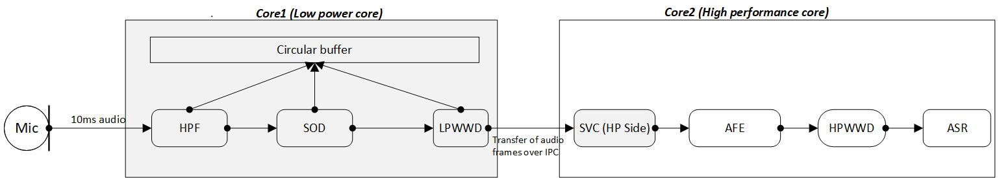
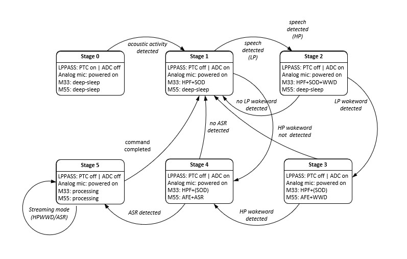

# Staged voice control middleware library

## Audio pipeline overview
 The next generation wearables and smart home appliances have microphone built into the product which allows the user to control the devices through voice commands. Since these devices need to continuously process real-time audio data they are considered always on. Devices which are battery operated has a limited battery life and limited power; therefore most of the components in the system remain in low power until woken up by a specific user action or voice command. Generally, battery operated devices have multi-stage architecture in which one core runs on lower CPU frequency and consumes less power whereas another core runs on higher CPU frequency and consumes more power. CPU which runs on higher CPU frequency remain in low power until woken up by the low power core to perform operations to save battery power.



The block diagram depicts the audio pipeline for the always-on devices in which the audio data is processed through the various components in the pipeline. Audio data captured from the microphone (e.g., "Ok Infineon, what is the time") on core1 are fed to the speech onset detection component which looks for the speech onset on the audio signals received from the microphone. If speech onset is present, then the audio frames are passed to low power wake word (LPWWD) component to confirm the wake word detection on core1 ("Ok Infineon"). Once the wake word is confirmed on core1, audio frames are sent to core2. Core2 receives the data and passes it to the audio front end component which filters out the noise, then the audio front end output is fed to the high performance wake word component (HPWWD) which re-confirms the wake word ("Ok Infineon"). If the wake word is detected on both the cores, then next set of audio frames are fed to the automatic speech recognition (ASR) component which does query identification ("What is the time").

   Abbreviation | Description
   ------|----------------------
   `HPF`| HPF stands for high pass filter. HPF component is an electronic filter that passes signals with a frequency higher than a certain cut-off frequency
   `SOD` | SOD stands for speech onset detection. SOD component is used to detect the beginning of a spoken word or utterance
   `LPWWD` | LPWWD stands for low power wake word detection. LPWWD component is used to detect the configured wake word (core1). (e.g., Alexa, Ok Google)
   `AFE` | AFE stands for audio front end. AFE component is used to filter out noise, echo from the audio. It comprises of beam forming, noise suppression, echo cancellation etc
   `HPWWD` | HPWWD stands for high performance wake word detection. HPWWD component is used to detect configured wake word on high performance core (core2)
   `ASR` | ASR stands for automatic speech recognition. ASR component is used to identify and process the words
   `IPC` | IPC stands for inter-process communication. IPC component provides physical link between core1 & core2 to transfer the data between cores

## Staged voice control middleware
As shown in the block diagram, highlighted blocks on core1 & core2 represents SVC middleware implementation. When the audio data passes through various stages of the pipeline, there is a need to maintain these stages in the system. SVC middleware running on core1 comprises of the SOD and LPWWD components internally. Staged voice control (SVC) middleware on core1 is responsible for maintaining the stages, feeding data to audio components based on the current stage, and sending data to core2 over the IPC channel, whereas the SVC middleware on core2 is responsible for receiving data over the IPC channel from core1, and providing it to the application for further processing.

Staged voice control middleware provides easy to use API on core1 to feed the audio data, get notified about current stage in the audio pipeline. On core2, it provides simple to use API to get the data from core1 and sending the notification about stage change to core1.

Following are the various SVC stages and their transition.

   SVC Stage        | Description
   -----------------|-------------------
   `SOD Stage` | SVC middleware running on core1 will be in this stage till speech onset is detected from the audio data. Audio data will be fed to the SOD component and once speech onset is detected, the SVC middleware running on core1 will transition to the next stage
   `LPWWD stage` | SVC middleware running on core1 feeds the audio data to the LPWWD component. Once the wake word is detected on core1, the SVC middleware running on core1 sends the audio frames to core2 over IPC and the SVC middleware on core1 will transition to the next stage
   `HPWWD stage` | SVC middleware running on core2 receives the audio frames from core1 over IPC and provides it to application running on core2. Application running on core2 feeds it to the next component AFE and HPWWD. Once the high performance wake word is detected, the application running on core2 notifies about the stage transition to core1 over IPC and the SVC middleware running on core1 will transition to the next stage
   `ASR stage` | SVC middleware running on core1 in this stage sends all the audio frames from core1 to core2 and waits for the stage transition notification from core2. SVC middleware running on core2 feeds the audio frames received from core1 to the ASR component. Once the query is detected, core2 sends notification to core1 about the stage transition and the SVC middleware running on core1 will transition to the next stage
   `ASR detected stage`  | Once the query is detected on core2, the SVC middleware running on core2 notifies about the stage transition to core1. SVC middleware running on core1 transition to next stage based on the configuration of the SVC middleware. In this stage, core2 application may perform response of ASR (playing audio data in speaker. e.g., music)



## Features supported
* Staged voice control middleware has in-built support for the wake word models (Ok Infineon, Hey Google, Alexa). User can choose one of the wake word model.
* Staged voice control middleware provides configuration of sample rate, audio input type (stereo/mono), and circular buffer size etc.
* Staged voice control middleware provides configuration to enable components in the audio pipeline based on the use case (e.g., it allows to enable SOD, LPWWD, HPWWD, ASR component in the system).
* Staged voice control middleware supports callback registration for the application to get through various stages when the audio data is being processed (such as speech detected, wake word detected etc.).

## Supported platforms
PSoC&trade; Edge E84 MCU - Core CM55 and Core CM33

## Supported toolchains
| Toolchain     | Version                                  |
| :---          | :----:                                   |
| Arm Compiler  | Arm&reg; Embedded Compiler 6.22          |
| LLVM Compiler | LLVM&reg; Embedded Compiler 19.1.5       |

## Quick start

### 1. Staged voice control middleware config for core1 (CM33)

**Include the following dependent libraries from 'Library Manager' tool:**
- [freertos](https://github.com/infineon/freertos)
- [connectivity-utilities](https://github.com/infineon/connectivity-utilities)
- [speech-onset-detection](https://github.com/infineon/speech-onset-detection)
- [audio-voice-core](https://github.com/infineon/audio-voice-core)
- [ml-middleware](https://github.com/infineon/ml-middleware)
- [ml-tflite-micro](https://github.com/infineon/ml-tflite-micro)

**Enable SOD and LPWWD internally to SVC:**
```makefile
DEFINES+=ENABLE_SVC_LP_MW ENABLE_SVC_ML_MW_SUPPORT EMBEDDED_DEV ENABLE_IFX_LPWWD ENABLE_IFX_SOD TF_LITE_STATIC_MEMORY
COMPONENTS+=IFX_LPWWD ML_INT8x8 NNLITE2
```

**Enable either TFLiteMicro or TFLiteMicro Less mode:**
```makefile
# For reduced footprint
COMPONENTS+=ML_TFLM_LESS
# Or
COMPONENTS+=ML_TFLM
```

**Additional Makefile configuration for model selection and inference engine:**
```makefile

# Enable a specific wake word model by adding one of the following
# Set model based on preferred wake word,
  # Select for ok Infineon
  COMPONENTS+=SVC_OK_INFINEON
  # Select for ok Alexa
  COMPONENTS+=SVC_ALEXA
  # Select for ok Hey Google
  COMPONENTS+=SVC_HEY_GOOGLE
# Note:- Only one of the above COMPONENTS should be enabled at a time to select the desired wake word model.

# NN model name
ifeq ($(filter SVC_OK_INFINEON,$(COMPONENTS)),SVC_OK_INFINEON)
    NN_MODEL_NAME=OK_INFINEON_INT8
endif
ifeq ($(filter SVC_ALEXA,$(COMPONENTS)),SVC_ALEXA)
    NN_MODEL_NAME=ALEXA_INT8
endif
ifeq ($(filter SVC_HEY_GOOGLE,$(COMPONENTS)),SVC_HEY_GOOGLE)
    NN_MODEL_NAME=HEY_GOOGLE_INT8
endif

# Configure inference engine and additional options
ifeq ($(filter ML_TFLM_LESS,$(COMPONENTS)),ML_TFLM_LESS)
    DEFINES+=TF_LITE_STRIP_ERROR_STRINGS
    DEFINES+=TF_LITE_MICRO_USE_OFFLINE_OP_USER_DATA
    NN_INFERENCE_ENGINE=tflm_less
    COMPONENTS+=ML_T_LESS_NNL2
    INCLUDES+=$(SEARCH_cmsis)/COMPONENT_CMSIS_NN/Include
endif
ifeq ($(filter ML_TFLM,$(COMPONENTS)),ML_TFLM)
    NN_INFERENCE_ENGINE=tflm
endif

NN_TYPE=int8x8
DEFINES+=MODEL_NAME=$(NN_MODEL_NAME)
```
*This logic ensures the correct model and inference engine are selected based on the enabled components.*

**Enable debug log messages (Optional):**
```makefile
DEFINES+=ENABLE_SVC_LP_LOGS
```

**Initialize logging in your application code:**
Call the `cy_log_init()` function provided by the *cy-log* module (part of *connectivity-utilities*). See the [connectivity-utilities library API documentation](https://cypresssemiconductorco.github.io/connectivity-utilities/api_reference_manual/html/group__logging__utils.html) for details.

---

### 2. Staged voice control middleware config for core2 (CM55)

**Include the following dependent libraries from 'Library Manager' tool:**
- [freertos](https://github.com/infineon/freertos)
- [connectivity-utilities](https://github.com/infineon/connectivity-utilities)

**Enable SVC high performance middleware:**
```makefile
DEFINES+=ENABLE_SVC_HP_MW
```

**Enable debug log messages (Optional):**
```makefile
DEFINES+=ENABLE_SVC_HP_LOGS
```

**Initialize logging in your application code:**
Call the `cy_log_init()` function provided by the *cy-log* module. See the [connectivity-utilities library API documentation](https://cypresssemiconductorco.github.io/connectivity-utilities/api_reference_manual/html/group__logging__utils.html) for details.

---

### 3. Common configuration for both core1 & core2

**Add the following to both core1 & core2 application's Makefile:**
```makefile
COMPONENTS+=FREERTOS RTOS_AWARE
```

**Audio Voice Core (AVC) component selection:**
```makefile
COMPONENTS+=AVC_DEMO   # Limited functionality for evaluation
# or
COMPONENTS+=AVC_FULL   # Full AVC capabilities for production (requires license)
```
**Note:** `AVC_DEMO` provides limited functionality for evaluation purposes. For production use with full AVC capabilities, use `AVC_FULL`. Contact Infineon support for licensing information and access to the full version.

### 4. Low Power Support

To enable low power support mode with SVC,

Add the following to your Makefile :
```makefile
DEFINES += ENABLE_LOW_POWER_SVC
```
This ensures proper operation and messaging during DeepSleep.

### Additional information
* [Staged voice control RELEASE.md](./RELEASE.md)
* [Connectivity utilities API documentation - for cy-log details](https://Infineon.github.io/connectivity-utilities/api_reference_manual/html/group__logging__utils.html)
* [ModusToolbox&trade; Software Environment, Quick Start Guide, Documentation, and Videos](https://www.infineon.com/cms/en/design-support/tools/sdk/modustoolbox-software/)
* [Staged voice control library version](./version.xml)